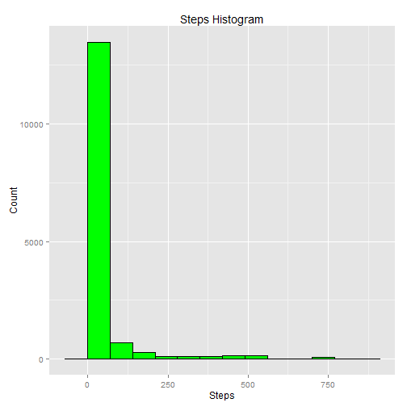
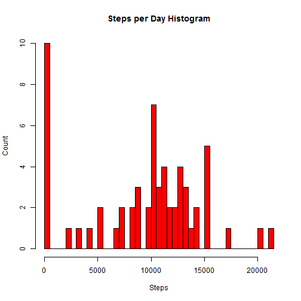
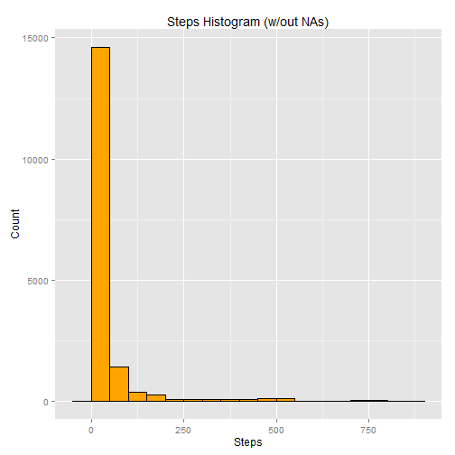
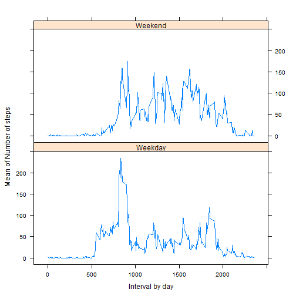

---
output:
  pdf_document: default
  html_document:
    fig_caption: yes
---
# Reproducible Research: Peer Assessment 1

## Summary
On this document we will:  
  
1. Unzip and load the source data  
2. Draw a histogram of steps taken per day
3. Calculate the Mean of steps taken per day  
4. Calculate the Median of steps taken per day  
5. Calculate the Average daily activity pattern  
6. Calculate the interval with max steps  
7. Impute missing values
8. Check if there are differences in activity patterns between weekdays and weekends


## Unzip and load the source data

```r
zipfilename <- "./activity.zip"
csvfilename <- "./activity.csv"

unzip(zipfile = zipfilename)
datasource <- read.csv(file = csvfilename)
datasource$date <- as.Date(datasource$date)

summary(datasource)
```

```
##      steps             date               interval     
##  Min.   :  0.00   Min.   :2012-10-01   Min.   :   0.0  
##  1st Qu.:  0.00   1st Qu.:2012-10-16   1st Qu.: 588.8  
##  Median :  0.00   Median :2012-10-31   Median :1177.5  
##  Mean   : 37.38   Mean   :2012-10-31   Mean   :1177.5  
##  3rd Qu.: 12.00   3rd Qu.:2012-11-15   3rd Qu.:1766.2  
##  Max.   :806.00   Max.   :2012-11-30   Max.   :2355.0  
##  NA's   :2304
```

## Histogram of steps taken per day


```r
library(ggplot2)

# 1st Histogram, do not aggregate
qplot(steps, geom='histogram', main="Steps Histogram", data=datasource, 
      binwidth=70, xlab="Steps", ylab="Count", fill=I("green"), col=I("black"))
```

 

```r
#Let's do it by day now
stepsdate <- with(
            data = datasource,
            aggregate(x=steps, by=list(date), FUN=function(x) sum(x, na.rm=TRUE))
            )

#Let's use hist function this time
hist(stepsdate$x, breaks=45, main="Steps per Day Histogram",
    col="red", xlab="Steps", ylab="Count" )
```

 


## What is the Mean and the Median total number of steps taken per day?

The Mean steps per day is 37.3825996.  
The Median steps per day is 0.  

## What is the Average daily activity pattern?


```r
interval <- list(as.factor(datasource$interval))
xmean <- aggregate(datasource$steps, interval, mean, na.rm=TRUE)
names(xmean) <- c("Interval", "Mean")

# Let's take a look at what are the 1st rows of xmean, shall we?
head(xmean)
```

```
##   Interval      Mean
## 1        0 1.7169811
## 2        5 0.3396226
## 3       10 0.1320755
## 4       15 0.1509434
## 5       20 0.0754717
## 6       25 2.0943396
```

```r
# Plot the mean of interval
npoints <- xmean[which(xmean$Mean == max(xmean$Mean)), ]
with(
  data = xmean,
  plot(Interval, Mean, type="n", col="blue"),
  lines(Interval, Mean),
  points(npoints, pch=5, cex=2, col="orange")
)
```

 

## The interval with Max steps in average across all days is 835 with 206.1698113 steps in average.  

## Imputing missing values

The number of observations with Null values is 2304 in a total of 17568 observations.  

In order to fill the gaps in the observation data, we will take the mean of the observations that are not missing.  


```r
# Add a new column to the data
datasource$steps_not_missing <- datasource$steps

for(i in levels(xmean$Interval)) {
  index  <- which(is.na(datasource$steps_not_missing) & datasource$interval == i)
  init <- datasource[index, ]$steps_not_missing
  val <- xmean[xmean$Interval == i, ]$Mean
  datasource[index, ]$steps_not_missing <- val
  after <- datasource[index, ]$steps_not_missing
}
```

After this calculation, the number of NAs was changed to 0. Isn't that great?  

So, let's plot it. This time we will try a different color.  
  


```r
qplot(data=datasource, steps_not_missing, geom="histogram", binwidth=50,
      main="Steps Histogram (w/out NAs)", xlab="Steps", ylab="Count", 
      , fill=I("orange"), col=I("black"))
```

 

Remember, before:  
The Mean steps per day was 37.3825996.  
The Median steps per day was 0.  

And now...  

The Mean steps per day is 37.3825996.  
The Median steps per day is 0.  

It did not change at all. Why?  
This is because the data is sckewd at 0 steps and we used the mean to fullfill the missing values.


## Are there differences in activity patterns between weekdays and weekends?


```r
# For this, let's important the Lattice package
library(lattice)

# 1st, define what is a weekday and what is a weekend
datasource$weekend <- weekdays(datasource$date) %in% c("Saturday", "Sunday")
datasource[datasource$weekend == T, ]$weekend <- "Weekend"
datasource[datasource$weekend == F, ]$weekend <- "Weekday"

plotfactor <- list(as.factor(datasource$interval), as.factor(datasource$weekend))
xmean <- aggregate(datasource$steps, plotfactor, mean, na.rm = TRUE)
names(xmean) <- c("Interval", "weekend", "mean")
xyplot(mean ~ as.numeric(as.vector(xmean$Interval)) | weekend, type="l", data=xmean, layout=c(1, 2), xlab="Interval by day", ylab="Mean of Number of steps")
```

 

Well, this is it. I hope you like it. Good bye!    

  
  
  
  
  

##### Code written by Igor Alcantara
###### E-mail: igor.alcantara@ipc-global.com


